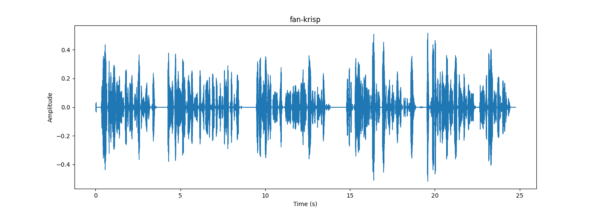

## bgvoice（背景声音）
| **处理工具** | **波形图** |
|----------|----------|
| [original](original/bgvoice.mp3) |  |
|[krisp(charge)](krisp/bgvoice-krisp.mp3) |  |
| [rnnoise](rnnoise/bgvoice-rnnoise.wav) |  |

## dog（狗叫）
| **处理工具** | **波形图** |
|----------|----------|
| [original](original/dog.mp3) |  |
|[krisp(charge)](krisp/dog-krisp.mp3) |  |
| [rnnoise](rnnoise/dog-rnnoise.wav) |  |

## fan（风扇）
| **处理工具** | **波形图** |
|----------|----------|
| [original](original/fan.mp3) |  |
|[krisp(charge)](krisp/fan-krisp.mp3) |  |
| [rnnoise](rnnoise/fan-rnnoise.wav) |  |

## child（婴儿哭）
| **处理工具** | **波形图** |
|----------|----------|
| [original](original/child.mp3) |  |
|[krisp(charge)](krisp/child-krisp.mp3) |  |
| [rnnoise](rnnoise/child-rnnoise.wav) |  |

## keyboard（敲击键盘）
| **处理工具** | **波形图** |
|----------|----------|
| [original](original/keyboard.mp3) |  |
|[krisp(charge)](krisp/keyboard-krisp.mp3) |  |
| [rnnoise](rnnoise/keyboard-rnnoise.wav) |  |

## scraping（刮纸）
| **处理工具** | **波形图** |
|----------|----------|
| [original](original/scraping.mp3) |  |
|[krisp(charge)](krisp/scraping-krisp.mp3) |  |
| [rnnoise](rnnoise/scraping-rnnoise.wav) |  |

## crumpling（揉塑料袋）
| **处理工具** | **波形图** |
|----------|----------|
| [original](original/crumpling.mp3) |  |
|[krisp(charge)](krisp/crumpling-krisp.mp3) |  |
| [rnnoise](rnnoise/crumpling-rnnoise.wav) |  |